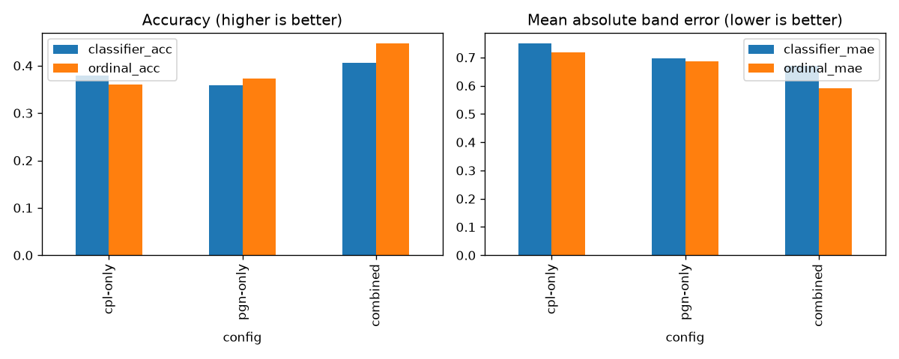
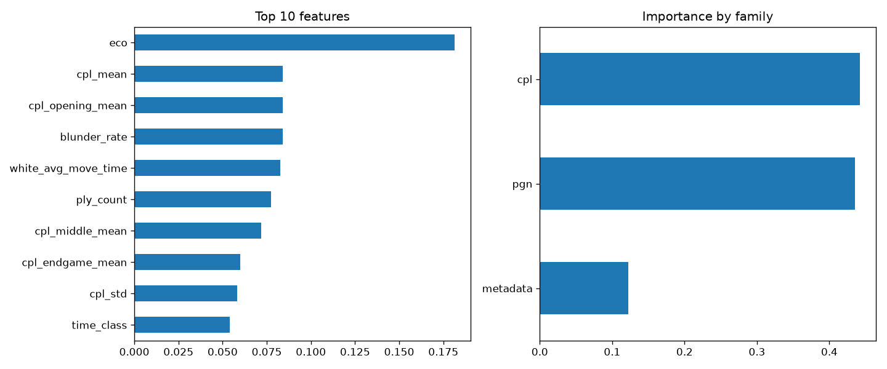

# EloSense

Can you guess a chess player's rating band just from how a game was played, without looking at their actual rating?

This project uses the [60,000+ Chess.com Games](https://www.kaggle.com/datasets/adityajha1504/chesscom-user-games-60000-games) dataset (Kaggle, CC0) and predicts a rating band (under 1000, 1000-1400, 1400-1800, 1800+) from game metadata like time control, format, and how the game ended, instead of predicting a rating from a rating.

## Key finding

A model can guess a player's rating band with about 86% accuracy, but almost all of that comes from knowing the opponent's rating band. Drop that feature and accuracy falls to 39%. Game metadata alone (time control, rules, rated, result type) is a weak signal on its own, most of the model's accuracy is really just picking up on chess.com's matchmaking, which pairs similarly rated players together.


## v2: PGN features

Follow-on notebook, `notebooks/elosense_v2.ipynb`, that parses the raw PGN move data with `python-chess` and tests whether "how the game was actually played" (opening, game length, material swings, time spent per move) predicts skill better than metadata alone.

With the opponent's rating band excluded from both, move-level features hit 42.8% accuracy vs metadata's 39.3%, and combining the two gets to 45.9%. Move-level data does carry more skill signal than plain metadata, but it doesn't come close to the 86% the model gets once it can see the opponent's rating band, matchmaking correlation is still the dominant signal in this dataset.

Extracted features are cached in `features/pgn_features.csv` so the ~5 minute full-dataset PGN parse doesn't have to be re-run.


## v3: honest evaluation and beyond

v1 and v2 both used a plain random train/test split with no grouping by player, so the same player could show up in both sides. `notebooks/elosense_v3.ipynb` fixes that with a player-disjoint split (no player's games appear on both sides), and rebuilds on top of the corrected baseline.

The leak mattered: under the honest split, metadata-only collapses from v2's 39.3% to 27.5% (barely above the 25% random baseline), and PGN features turn out to be the real, generalizable signal. From there, v3 adds player-level feature aggregation, Stockfish-derived centipawn-loss features, an ordinal (regress-then-bin) framing instead of plain classification, and swaps in LightGBM. The final config gets **48.8% accuracy** and **0.564 mean absolute band error** on players the model never trained on, actually beating v2's leaky 45.9% despite the honest split being a strictly harder test.





## How to run

```
python3 -m venv venv
source venv/bin/activate
pip install -r requirements.txt
```

Download `club_games_data.csv` from [Kaggle](https://www.kaggle.com/datasets/adityajha1504/chesscom-user-games-60000-games) and place it in `data/` (not tracked in git). Then open `notebooks/elosense_v1.ipynb` and run top to bottom.

## What's in the notebooks

`notebooks/elosense_v1.ipynb` goes through the core project in order: loading the data, checking for nulls and duplicates, exploring rating and result distributions, bucketing ratings into bands, encoding features, testing for leakage, training a baseline and an improved model, comparing them, and writing up the findings.

`notebooks/elosense_v2.ipynb` is the follow-on v2 notebook described above, it parses PGN move data and tests move-level features against the v1 metadata baseline.

`notebooks/elosense_v3.ipynb` is the v3 notebook described above. It doesn't touch v1 or v2, it re-derives its own honest baseline under a player-disjoint split and builds forward from there. Reproducing the Stockfish centipawn-loss section requires `stockfish` on PATH (`brew install stockfish`), but the extracted features are cached in `features/cpl_features_v3.csv` and `features/pgn_features_v3.csv` so that step doesn't need to be re-run to read the notebook's results.
