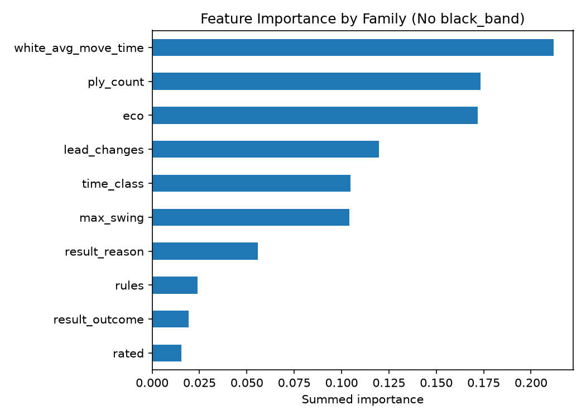

# EloSense

Can you guess a chess player's rating band just from how a game was played, without looking at their actual rating?

This project uses the [60,000+ Chess.com Games](https://www.kaggle.com/datasets/adityajha1504/chesscom-user-games-60000-games) dataset (Kaggle, CC0) and predicts a rating band (under 1000, 1000-1400, 1400-1800, 1800+) from game metadata like time control, format, and how the game ended, instead of predicting a rating from a rating.

## Key finding

A model can guess a player's rating band with about 86% accuracy, but almost all of that comes from knowing the opponent's rating band. Drop that feature and accuracy falls to 39%. Game metadata alone (time control, rules, rated, result type) is a weak signal on its own, most of the model's accuracy is really just picking up on chess.com's matchmaking, which pairs similarly rated players together.


## v2: PGN features

Follow-on notebook, `notebooks/elosense_pgn_features.ipynb`, that parses the raw PGN move data with `python-chess` and tests whether "how the game was actually played" (opening, game length, material swings, time spent per move) predicts skill better than metadata alone.

With the opponent's rating band excluded from both, move-level features hit 42.8% accuracy vs metadata's 39.3%, and combining the two gets to 45.9%. Move-level data does carry more skill signal than plain metadata, but it doesn't come close to the 86% the model gets once it can see the opponent's rating band, matchmaking correlation is still the dominant signal in this dataset.

Extracted features are cached in `features/pgn_features.csv` so the ~5 minute full-dataset PGN parse doesn't have to be re-run.



## How to run

```
python3 -m venv venv
source venv/bin/activate
pip install -r requirements.txt
```

Download `club_games_data.csv` from [Kaggle](https://www.kaggle.com/datasets/adityajha1504/chesscom-user-games-60000-games) and place it in `data/` (not tracked in git). Then open `notebooks/elosense.ipynb` and run top to bottom.

## What's in the notebooks

`notebooks/elosense.ipynb` goes through the core project in order: loading the data, checking for nulls and duplicates, exploring rating and result distributions, bucketing ratings into bands, encoding features, testing for leakage, training a baseline and an improved model, comparing them, and writing up the findings.

`notebooks/elosense_pgn_features.ipynb` is the follow-on v2 notebook described above, it parses PGN move data and tests move-level features against the v1 metadata baseline.
