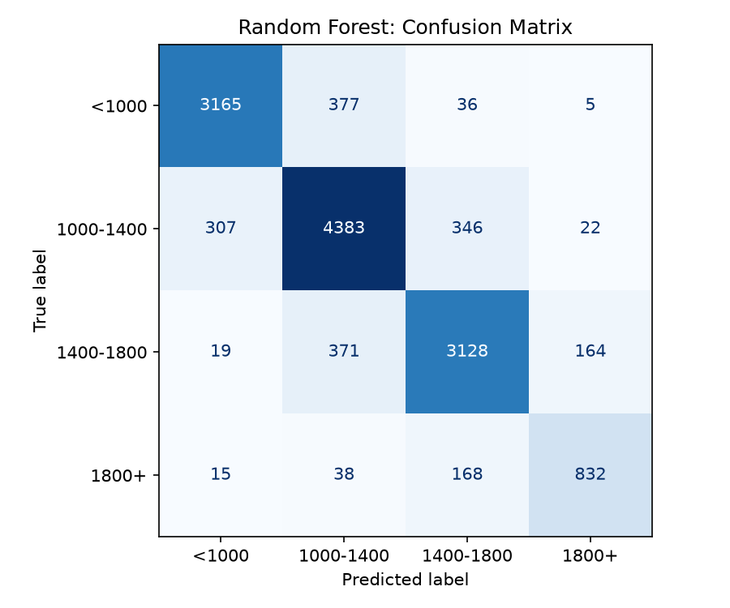
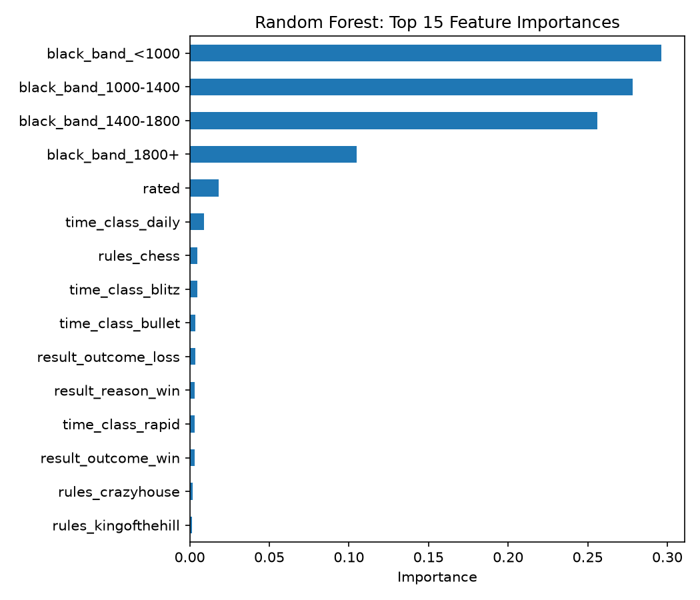

# EloSense

Can you guess a chess player's rating band just from how a game was played, without looking at their actual rating?

This project uses the [60,000+ Chess.com Games](https://www.kaggle.com/datasets) dataset (Kaggle, CC0) and predicts a rating band (under 1000, 1000-1400, 1400-1800, 1800+) from game metadata like time control, format, and how the game ended, instead of predicting a rating from a rating.

## Key finding

A model can guess a player's rating band with about 86% accuracy, but almost all of that comes from knowing the opponent's rating band. Drop that feature and accuracy falls to 39%. Game metadata alone (time control, rules, rated, result type) is a weak signal on its own, most of the model's accuracy is really just picking up on chess.com's matchmaking, which pairs similarly rated players together.





## How to run

```
python3 -m venv venv
source venv/bin/activate
pip install -r requirements.txt
```

Download `club_games_data.csv` from Kaggle and place it in `data/` (not tracked in git). Then open `notebooks/elosense.ipynb` and run top to bottom.

## What's in the notebook

One notebook, `notebooks/elosense.ipynb`, that goes through the whole project in order: loading the data, checking for nulls and duplicates, exploring rating and result distributions, bucketing ratings into bands, encoding features, testing for leakage, training a baseline and an improved model, comparing them, and writing up the findings.
